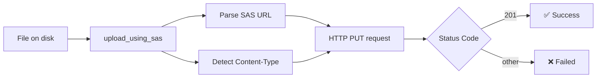

<div align="center">

# 📦 Azure Storage — Upload File via SAS URL

**A tiny, dependency-light Python utility for uploading files to Azure Blob Storage using a SAS token.**

[![Forks][forks-shield]][forks-url]
[![Stargazers][stars-shield]][stars-url]
[![Issues][issues-shield]][issues-url]
[![MIT License][license-shield]][license-url]

</div>

---

## ✨ Overview

Azure Blob Storage can be accessed using a **SAS (Shared Access Signature)** token — a common pattern when one application issues a short-lived, scoped URL to another application, which then uploads a file directly to blob storage without needing full account credentials.

This repo gives you a single function that does exactly that: hand it a SAS URL and a file path, and it uploads the file via an HTTP `PUT` request.

## 🚀 Features

- 🔑 **No account keys required** — works entirely off a SAS URL/token
- 📄 **Auto content-type detection** based on file extension
- ⚡ **Minimal dependencies** — just `requests` and `azure-storage-blob`
- ✅ **Simple status handling** — returns the HTTP status code (`201` = success)

## 📋 Prerequisites

- Python 3.9+
- A valid Azure Blob Storage SAS URL

## 🔧 Installation

```bash
pip install requests
pip install azure-storage-blob
```

## 💻 Usage

```python
from main import upload_using_sas

sas_url = "https://<account>.blob.core.windows.net/<container>/<blob>?<sas-token>"
file_path = "C:/path/to/your/file.mp3"

status_code = upload_using_sas(sas_url, file_path)

if status_code == 201:
    print("✅ Upload successful")
else:
    print(f"❌ Upload failed — status code: {status_code}")
```

> See [`main.py`](./main.py) for the full reference implementation.

## 📖 Function Reference

| Function | Description |
|---|---|
| `upload_using_sas(sas_url, file_name_full_path)` | Parses the SAS URL, detects content type from the file extension, and uploads the file via HTTP `PUT`. Returns the HTTP status code (`201` indicates success). |

## ⚙️ How It Works



## 📄 License

Distributed under the **MIT License**. See [`LICENSE`][license-url] for details.

---

<div align="center">

Made with 🐍 Python · [Report an issue][issues-url] · [Star this repo][stars-url]

</div>

<!-- MARKDOWN LINKS & IMAGES -->
<!-- https://www.markdownguide.org/basic-syntax/#reference-style-links -->

